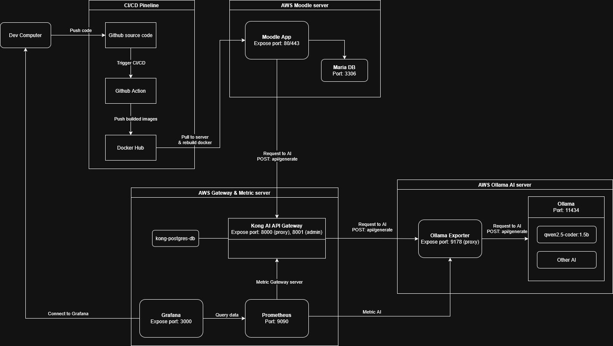

# Moodle AI Platform - AI-Integrated Learning Management System

## Project Overview

This project builds a Moodle LMS platform integrated with AI, deployed on AWS with microservices architecture, automated CI/CD pipeline, and metrics monitoring system.

## System Architecture

### **CI/CD Pipeline**
- **Dev Computer** → Push code to **GitHub**
- **GitHub Actions** automatically builds and creates Docker images
- **Docker Hub** stores images
- Servers automatically pull new images and rebuild containers

### **Server 1: AWS Moodle Server**
- **Moodle App** (Port 80/443): Main LMS application with integrated AI features
- **MariaDB** (Port 3306): Data storage database
- Moodle sends requests to Kong Gateway via `/api/generate` endpoint

### **Server 2: AWS Gateway & Metric Server**
- **Kong AI API Gateway** (Port 8000/8001): 
  - Routes and manages requests from Moodle to Ollama Exporter (AI proxy)
  - Handles authentication, rate limiting, logging
  - Database: PostgreSQL
- **Prometheus** (Port 9090): Collects and stores metrics
- **Grafana** (Port 3000): Dashboard for metrics visualization and monitoring

### **Server 3: AWS Ollama AI Server**
- **Ollama AI** (Port 11434): Runs AI models (qwen2.5-coder:1.5b, etc.)
- **Ollama Exporter** (Port 9178): Exports AI metrics for Prometheus collection and acts as a proxy for Ollama AI

## Repositories

### 1. KongGateway
https://github.com/layducky/KongGateway

**Function**: Launch Kong AI API Gateway & Ollama AI Server

**Includes**:
- Kong Gateway with AI plugins
- Ollama AI Server and models
- Prometheus & Grafana monitoring
- Docker Compose configurations

### 2. moodle-k8s-project
https://github.com/nguyendangcuong201004/moodle-k8s-project

**Function**: Moodle source code and Docker packaging

**Includes**:
- Moodle source code with integrated AI features
- Dockerfile and docker-compose
- CI/CD workflows with GitHub Actions
- MariaDB configuration

### 3. moodle-k8s-infra
https://github.com/nguyendangcuong201004/moodle-k8s-infra

**Function**: Infrastructure as Code (IaC) with Terraform & Kubernetes

**Includes**:
- Terraform scripts for AWS infrastructure provisioning
- Kubernetes manifests (deployments, services)
- Network and security configurations
- AWS resources: VPC, EKS, Load Balancers

## Technology Stack

- **Frontend/Backend**: Moodle LMS (PHP)
- **Database**: MariaDB
- **API Gateway**: Kong Gateway
- **AI Engine**: Ollama (qwen2.5-coder:1.5b)
- **Monitoring**: Prometheus + Grafana
- **Container**: Docker & Docker Compose
- **Orchestration**: Kubernetes (K8s)
- **Infrastructure**: Terraform
- **Cloud Provider**: AWS (VPC, EKS, EC2)
- **CI/CD**: GitHub Actions

---

**This project demonstrates**: Microservices architecture, DevOps practices (CI/CD, IaC), Cloud deployment, AI integration, and Monitoring & Observability.